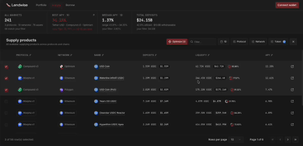
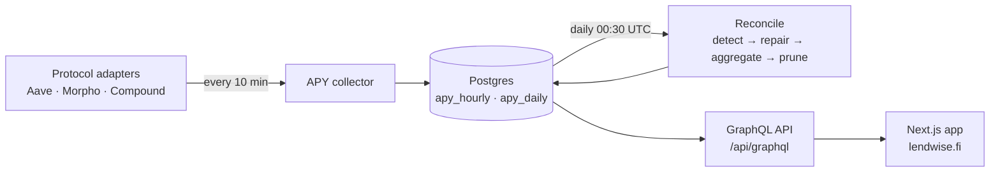

<div align="center">
  <a href="https://lendwise.fi">
    
  </a>

<br />

# Unified view for lending markets. One standard.

Lendwise compares and monitors 700+ lending markets across **Aave**, **Morpho**, **Compound**, **Blend** and more. It standardizes rates to net APY (base ± fees ± rewards) and optimizes your capital allocation.

[](https://github.com/lendwise-fi/lendwise/actions/workflows/ci.yml)
[](LICENSE)
[](tsconfig.json)
[](CONTRIBUTING.md)

[**Live App**](https://lendwise.fi) · [Documentation](docs/) · [X / Twitter](https://x.com/Lendwisefi) · [Farcaster](https://farcaster.xyz/lendwise) · [Discussions](https://github.com/lendwise-fi/lendwise/discussions)



</div>

> ⭐ **If Lendwise helps you find better yields, [star the repo](https://github.com/lendwise-fi/lendwise/stargazers)** — it helps other DeFi users discover it.

## Why Lendwise?

Comparing lending yields across protocols is harder than it looks: every protocol quotes
rates differently (APR vs APY, per-second vs daily compounding), rewards live in separate
systems (protocol emissions, Merkl campaigns), and fees quietly eat into headline numbers.

Lendwise reduces it to two promises:

### 📏 One standard

Here are standardized APYs — now you can actually compare them.

- **One net APY** — every rate converted to APY and netted: supply
  `base − fees + rewards`, borrow `base + fees − rewards`. Headline numbers that mean
  the same thing on every protocol.
- **Fresh** — every market re-sampled every 10 minutes.
- **Historical** — hourly averages and daily aggregates for 180 days, kept whole by a
  nightly reconcile job that detects gaps, repairs them, and re-aggregates the days
  they belong to.
- **Complete** — ~700 active markets, ~120 assets, supply _and_ borrow sides,
  collateral parameters included.

### 🎯 One allocation

Here is how to allocate your capital — matched to your risk profile and investment horizon.

- **Optimizer** — allocation suggestions across markets, driven by your risk level and
  how long the capital stays deployed.
- **Portfolio-aware** — connect a wallet to see your positions across all protocols and
  chains, and where they could earn more.

## Supported protocols & chains

| Protocol                       | Ethereum | Optimism | Polygon | Base | Arbitrum | Avalanche | Linea | BSC |
| ------------------------------ | :------: | :------: | :-----: | :--: | :------: | :-------: | :---: | :-: |
| **Aave V3**                    |    ✅    |    ✅    |   ✅    |  ✅  |    ✅    |    ✅     |  ✅   | ✅  |
| **Morpho** (Blue + MetaMorpho) |    ✅    |    ✅    |   ✅    |  ✅  |    ✅    |     —     |   —   |  —  |
| **Compound V3**                |    ✅    |    ✅    |   ✅    |  ✅  |    ✅    |     —     |   —   |  —  |

Want another protocol? **[Request it](https://github.com/lendwise-fi/lendwise/issues/new?template=protocol_request.yml)** — or
[build the adapter yourself](#contributing): it's ~5 files with a test harness to validate it.

## How it works



Each protocol is an isolated **adapter** that transforms its source (GraphQL API, subgraph,
RPC) into a shared data model. Aggregation uses `Promise.allSettled` everywhere — one
protocol having a bad day never blocks the others. The full design is documented in
[`src/lib/protocols/README.md`](src/lib/protocols/README.md) and [`docs/`](docs/).

## Quick start

Prerequisites: Node.js 24, [pnpm](https://pnpm.io) 11.

```bash
git clone https://github.com/lendwise-fi/lendwise
cd lendwise
pnpm install
cp .env.example .env.local   # minimal: THEGRAPH_API_KEY (free) — see CONTRIBUTING.md
pnpm dev                     # → http://localhost:3000
```

<details>
<summary><strong>Useful commands</strong></summary>

```bash
pnpm codegen          # regenerate GraphQL types (run before typecheck/test)
pnpm lint             # ESLint
pnpm typecheck        # tsc --noEmit (strict)
pnpm test             # vitest
pnpm adapter:test <id>  # live-test a protocol adapter (e.g. aave_v3)
pnpm build            # codegen + next build
```

</details>

## Tech stack

Next.js 16 (App Router) · TypeScript strict · Tailwind 4 + Radix UI · viem/wagmi ·
PostgreSQL (Neon) + Drizzle ORM · GraphQL (graphql-yoga + URQL + codegen) · The Graph ·
QStash cron.

## Documentation

| Doc                                              | What's inside                                                          |
| ------------------------------------------------ | ---------------------------------------------------------------------- |
| [Protocol adapters](src/lib/protocols/README.md) | Architecture, adapter contract, how to add a protocol                  |
| [APY pipeline](docs/apy-pipeline-gap-heal.md)    | Nightly reconcile job — gap detection, repair, aggregation and pruning |
| [APY daily schema](docs/APY_DAILY_SCHEMA.md)     | How historical aggregates are computed                                 |
| [Products schema](docs/PRODUCTS_SCHEMA.md)       | The product registry data model                                        |
| [Contributing guide](CONTRIBUTING.md)            | Setup, quality bar, PR process                                         |

## Contributing

Contributions are welcome — the most valuable one is a **new protocol adapter**, and the
codebase is explicitly designed to make that a contained, testable unit of work
(~5 files + a live test harness).

- Read [**CONTRIBUTING.md**](CONTRIBUTING.md) — includes a
  ["first PR in 15 minutes"](CONTRIBUTING.md#your-first-pr-in-15-minutes) path
- Check [`good first issue`](https://github.com/lendwise-fi/lendwise/labels/good%20first%20issue)
  and [`protocol-request`](https://github.com/lendwise-fi/lendwise/labels/protocol-request) labels
- Ask anything in [Discussions](https://github.com/lendwise-fi/lendwise/discussions)

## Community

- 🌐 [lendwise.fi](https://lendwise.fi) — the live app
- 🐦 [@Lendwisefi](https://x.com/Lendwisefi) — announcements
- 🟪 [Farcaster](https://farcaster.xyz/lendwise)
- 💬 [GitHub Discussions](https://github.com/lendwise-fi/lendwise/discussions) — questions & ideas
- 📧 [hello@lendwise.fi](mailto:hello@lendwise.fi)

## License

[MIT](LICENSE) © Lendwise
