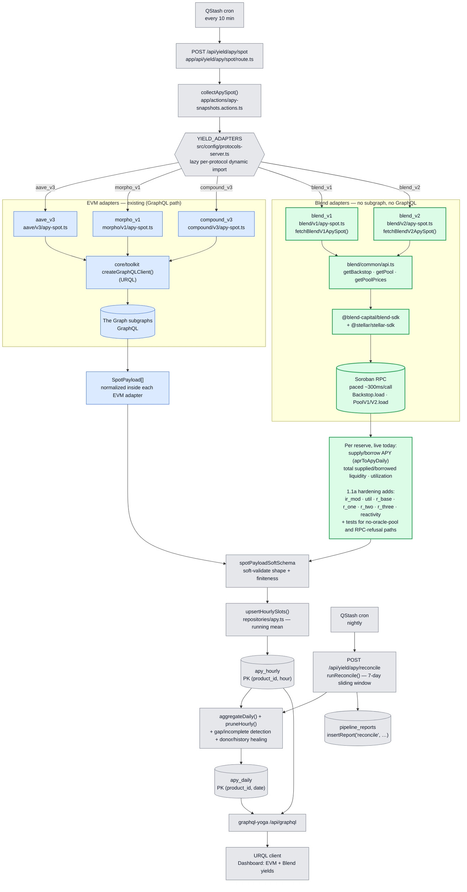
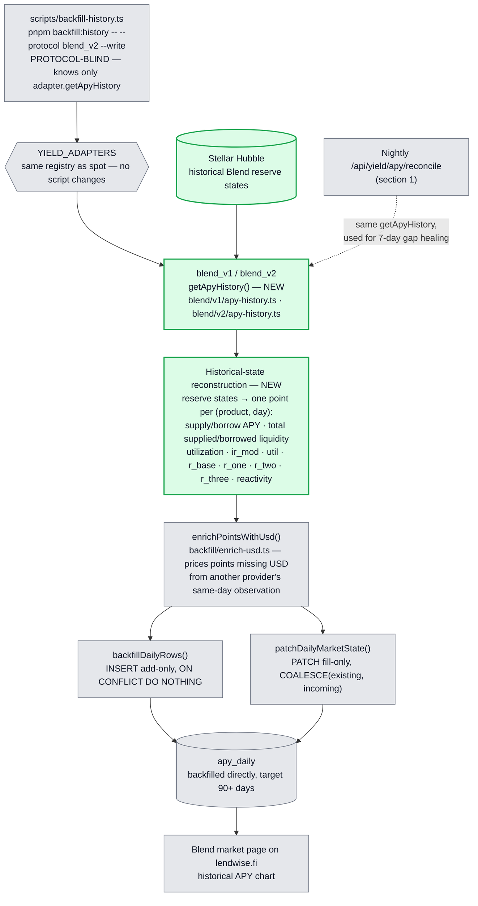

# LendWise — Protocol Processing Flow & Blend Integration

> **Legend** — green = NEW bricks added for Stellar/Blend ·
> blue = existing EVM pipeline (unchanged) · grey = shared core (unchanged).

---

## 1. Spot market data — current EVM protocols + Blend addition

**Reading the diagram** — matches the code as implemented, not a future design.

- The trigger, registry, `apy_hourly`/`apy_daily`, the nightly reconcile job, and the GraphQL
  serving layer are **shared and unchanged** — protocol-agnostic by design. `YIELD_ADAPTERS` in
  `src/config/protocols-server.ts` is the actual registry: a plain record of lazy dynamic imports
  keyed by protocol id (`aave_v3`, `morpho_v1`, `compound_v3`, `blend_v1`, `blend_v2`).
  `collectApySpot()` calls `getApySpot()` on every registered id via `Promise.allSettled`.
- Existing EVM protocols read through **The Graph subgraphs** via `createGraphQLClient()`.
- **Blend has no subgraph**, so `blend_v1`/`blend_v2` bypass GraphQL entirely, reading **Soroban
  contracts** through the **Blend SDK**. Both share `blend/common/api.ts`, which discovers the
  live pool set from `Backstop.load(...).config.rewardZone` rather than a hardcoded list, and
  serializes every RPC read behind a ~300ms pacing queue to stay under Soroban RPC's rate limit.
  This is the same uniform `<protocol>/<version>/apy-spot.ts` layout every EVM adapter already
  follows (`aave/v3/`, `morpho/v1/`, `compound/v3/`) — not a Blend-specific exception.
- **Already live:** supply/borrow APY, total supplied/borrowed liquidity, and utilization per
  reserve. **Not yet captured — this is 1.1a's hardening deliverable:** the interest rate modifier
  (`ir_mod`) and rate parameters (`util`, `r_base`, `r_one`, `r_two`, `r_three`, `reactivity`),
  plus test coverage for the no-oracle-pool and RPC-refusal failure paths already handled in code.
- Each adapter — EVM or Blend — returns `SpotPayload[]` **already normalized internally**; there is
  no separate shared normalization stage. `collectApySpot()` only soft-validates
  (`spotPayloadSoftSchema`) and upserts via `upsertHourlySlots()`.
- There is no separate daily cron: a single **nightly `/api/yield/apy/reconcile`** job
  (`runReconcile()`, 7-day sliding window) detects gaps/incomplete hours, heals them from donor
  products or via `adapter.getApyHistory()`, aggregates `apy_hourly` into `apy_daily`, prunes old
  hourly rows, and logs one row per run into `pipeline_reports`.

---

## 2. Historical market data — Stellar Hubble reconstruction (NEW)

**Reading the diagram**

- Blend has **no subgraph and no history API** of its own — unlike Aave's official subgraph or
  Compound's REST API — so there is no existing endpoint to call. Historical data has to be
  **reconstructed**, not fetched.
- The reconstruction queries **historical Blend reserve states from Stellar Hubble** and converts
  them into one point per (product, day), matching the shape every other `getApyHistory`
  implementation already returns. **This is not event replay** — reserve-state reconstruction, not
  transaction/event indexing.
- This branch is **separate from spot ingestion**: spot reads live Soroban RPC state on a
  10-minute cron and writes `apy_hourly`; historical reconstruction is consumed by two existing,
  protocol-blind callers of `adapter.getApyHistory()` — the manual `scripts/backfill-history.ts`
  harness, which writes straight into `apy_daily` (`backfillDailyRows` for missing days,
  `patchDailyMarketState` to fill market columns on rows that already exist), and the nightly
  reconcile job's nightly gap-healing (section 1) — **neither requires any change**, only
  registering `blend_v1`/`blend_v2`'s `getApyHistory()`.
- Output lands in the same `apy_hourly`/`apy_daily` tables every other protocol writes to, so
  serving, aggregation, and the optimizer (see `architecture-stellar-integration.md`) need no
  Blend-specific handling downstream of this point.

---

## 3. Wallet layer — connection shipped, SEP-10 authentication is NEW

```mermaid
flowchart LR
    subgraph Wallets["Stellar wallets — already shipped"]
        direction TB
        Freighter["Freighter"]
        XBull["xBull"]
        Lobstr["Lobstr"]
        Albedo["Albedo"]
    end

    Wallets --> StellarKit["StellarWalletContext.tsx<br/>@creit-tech/stellar-wallets-kit<br/>StellarWalletsKit.authModal()"]
    StellarKit --> Store["Zustand walletStore<br/>chainFamily: 'evm' | 'stellar' | 'bitcoin'"]

    subgraph SEP10["SEP-10 authentication — NEW (1.2)"]
        direction TB
        Challenge["LendWise backend issues<br/>SEP-10 challenge"]
        Sign["Wallet signs challenge"]
        Verify["LendWise backend<br/>verifies signature"]
        Session["Authenticated Stellar session"]
        Challenge --> Sign --> Verify --> Session
    end

    StellarKit -.->|"connect today: bare public key,<br/>no signature round trip"| Challenge
    Session -.->|"NEW: persist session,<br/>not just the address"| Store

    Wagmi["WagmiProvider + RainbowKit<br/>EVM — existing"] -->|"0x… address (viem)"| Store
    Store --> Dashboard["Unified dashboard<br/>EVM + Blend positions & portfolio"]

    classDef core fill:#e5e7eb,stroke:#6b7280,color:#111827;
    classDef evm fill:#dbeafe,stroke:#2563eb,color:#111827;
    classDef stellar fill:#dcfce7,stroke:#16a34a,color:#111827,stroke-width:2px;
    class Store,Dashboard core;
    class Wagmi evm;
    class Wallets,Freighter,XBull,Lobstr,Albedo,StellarKit,Challenge,Sign,Verify,Session stellar;
```

**Already shipped:** `src/contexts/StellarWalletContext.tsx` covers **Freighter, xBull, Lobstr,
and Albedo** through `@creit-tech/stellar-wallets-kit`'s `authModal()`, running alongside
`WagmiProvider`. The connected address is written into the existing Zustand `walletStore`
(`src/stores/walletStore.ts`), which already carries a `chainFamily` discriminator
(`'evm' | 'stellar' | 'bitcoin'`) — this is not new wiring, it is how EVM wallets persist today
too.

**NEW (1.2):** today's connect is a bare public-key read with no signature involved. SEP-10 adds
the missing authentication round trip on top of the existing context: the backend issues a
challenge transaction, the wallet signs it, the backend verifies the signature, and only then is
an authenticated **session** — not just an address — persisted. Blend position reads and the
health factor built on top of that session are detailed in
`architecture-stellar-integration.md`.

---

## 4. New vs existing — at a glance

| Brick                            | Status       | Library / path                                                          |
| :-------------------------------- | :----------- | :---------------------------------------------------------------------- |
| Adapter registry                  | existing     | `YIELD_ADAPTERS` — `src/config/protocols-server.ts`                     |
| Spot collection                   | existing     | `collectApySpot()` — `app/actions/apy-snapshots.actions.ts`             |
| EVM data source                   | existing     | The Graph subgraphs via `createGraphQLClient()` (URQL)                  |
| `apy_hourly` / `apy_daily`         | existing     | `repositories/apy.ts` + Drizzle schema                                  |
| Nightly reconcile (aggregate/heal) | existing     | `/api/yield/apy/reconcile` — `runReconcile()`                           |
| GraphQL serving                    | existing     | `graphql-yoga` `/api/graphql`                                           |
| Blend V1 spot adapter              | **shipped**  | `src/lib/protocols/blend/v1/apy-spot.ts`                                |
| Blend V2 spot adapter              | **shipped**  | `src/lib/protocols/blend/v2/apy-spot.ts`                                |
| Blend data source                  | **shipped**  | `@blend-capital/blend-sdk` + `@stellar/stellar-sdk` over Soroban RPC    |
| Stellar wallet connection          | **shipped**  | `StellarWalletContext.tsx` — Freighter / xBull / Lobstr / Albedo        |
| `chainFamily` store field          | **shipped**  | `src/stores/walletStore.ts`                                             |
| **Blend rate-parameter fields**    | **NEW (1.1a)** | `ir_mod` / `util` / `r_base` / `r_one` / `r_two` / `r_three` / `reactivity` + failure-path tests |
| **Blend historical adapter**       | **NEW (1.1b)** | `blend/v1/apy-history.ts` + `blend/v2/apy-history.ts` — `getApyHistory()` |
| **Stellar Hubble backfill**        | **NEW (1.1b)** | historical reserve-state reconstruction, consumed by the existing `scripts/backfill-history.ts` and nightly reconcile |
| **SEP-10 authentication**          | **NEW (1.2)**  | backend challenge endpoint + client-side signing flow + session persistence |
