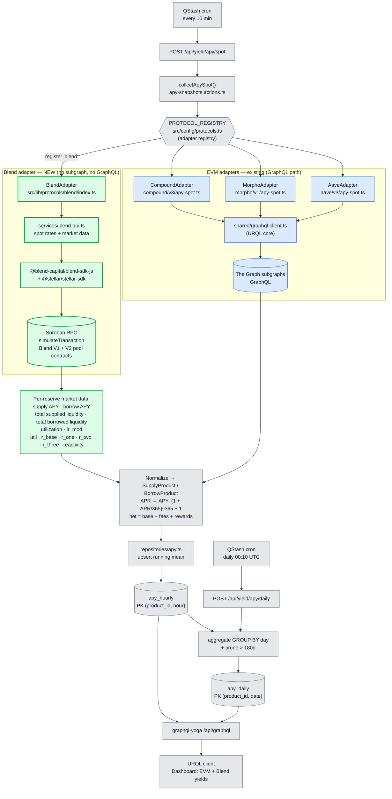
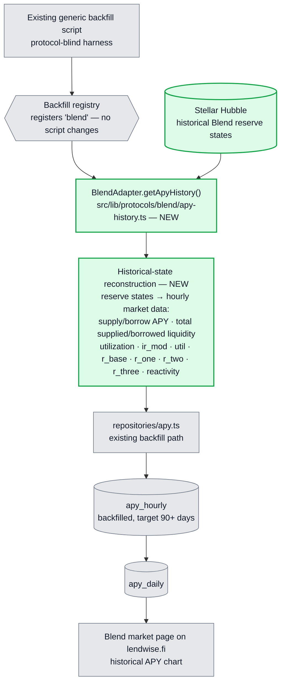

# LendWise — Protocol Processing Flow & Blend Integration

> **Legend** — green = NEW bricks added for Stellar/Blend ·
> blue = existing EVM pipeline (unchanged) · grey = shared core (unchanged).

---

## 1. Spot market data — current EVM protocols + Blend addition

**Reading the diagram**

- The trigger, registry, normalization, `apy_hourly`/`apy_daily`, and the GraphQL serving layer
  are **shared and unchanged** — they are protocol-agnostic by design.
- Existing EVM protocols read through **The Graph subgraphs** via the shared URQL GraphQL client.
- **Blend has no subgraph**, so the new adapter **bypasses GraphQL entirely**: it reads pool
  rates from **Soroban contracts** through the **Blend SDK** over **Soroban RPC**
  (`simulateTransaction`), discovering the live pool set from `Backstop.load(...).config.rewardZone`
  rather than a hardcoded list, across both **Blend V1 and V2**.
- For each reserve it retrieves supply APY, borrow APY, total supplied liquidity, total borrowed
  liquidity, utilization, the interest rate modifier (`ir_mod`), and the interest rate parameters
  (`util`, `r_base`, `r_one`, `r_two`, `r_three`, `reactivity`) — then hands normalized
  `SupplyProduct`/`BorrowProduct` objects to the same pipeline as every other protocol.
- Adding Blend = register `'blend'` in `PROTOCOL_REGISTRY` + ship the green bricks. Nothing in the
  blue/grey path changes.

---

## 2. Historical market data — Stellar Hubble reconstruction (NEW)

**Reading the diagram**

- Blend has **no subgraph and no history API** of its own — unlike Aave's official subgraph or
  Compound's REST API — so there is no existing endpoint to call. Historical data has to be
  **reconstructed**, not fetched.
- The reconstruction queries **historical Blend reserve states from Stellar Hubble** and converts
  them into the same hourly market-data shape produced by the spot adapter (section 1). **This is
  not event replay** — the approach is reserve-state reconstruction at hourly intervals, not
  transaction/event indexing.
- This branch is **separate from spot ingestion**: spot reads live Soroban RPC state on a 10-minute
  cron; historical reconstruction reads Hubble and runs through the existing protocol-blind
  backfill harness, which requires no changes to the harness itself — only registering Blend's
  `getApyHistory()`.
- Output lands in the same `apy_hourly`/`apy_daily` tables every other protocol writes to, so
  serving, aggregation, and the optimizer (see `architecture-stellar-integration.md`) need no
  Blend-specific handling downstream of this point.

---

## 3. Wallet layer — SEP-10 authentication & multi-ecosystem coexistence

```mermaid
flowchart LR
    subgraph Wallets["Stellar wallets — NEW"]
        direction TB
        Freighter["Freighter"]
        XBull["xBull"]
        Lobstr["Lobstr"]
        Albedo["Albedo"]
    end

    Wallets --> StellarKit["StellarWalletContext<br/>@creit-tech/stellar-wallets-kit"]
    StellarKit --> Challenge["LendWise backend issues<br/>SEP-10 challenge"]
    Challenge --> Sign["Wallet signs challenge"]
    Sign --> Verify["LendWise backend<br/>verifies signature"]
    Verify --> Session["Authenticated Stellar session"]

    Wagmi["WagmiProvider + RainbowKit<br/>EVM — existing"] -->|"0x… address (viem)"| Store["Zustand walletStore<br/>chainFamily: 'evm' | 'stellar'"]
    Session -->|"G… public key"| Store
    Store --> Dashboard["Unified dashboard<br/>EVM + Blend positions & portfolio"]

    classDef core fill:#e5e7eb,stroke:#6b7280,color:#111827;
    classDef evm fill:#dbeafe,stroke:#2563eb,color:#111827;
    classDef stellar fill:#dcfce7,stroke:#16a34a,color:#111827,stroke-width:2px;
    class Store,Dashboard core;
    class Wagmi evm;
    class Wallets,Freighter,XBull,Lobstr,Albedo,StellarKit,Challenge,Sign,Verify,Session stellar;
```

**New bricks (green):** `@creit-tech/stellar-wallets-kit` + a `StellarWalletContext` covering
**Freighter, xBull, Lobstr, and Albedo**, running **alongside** `WagmiProvider`. Connecting a
Stellar wallet is not just a key read — it goes through a full **SEP-10** round trip: the backend
issues a challenge transaction, the wallet signs it, the backend verifies the signature, and only
then is the session persisted into the existing Zustand `walletStore` once it carries a
`chainFamily` discriminator. EVM wallet flow is untouched. Blend position reads and the health
factor built on top of this session are detailed in `architecture-stellar-integration.md`.

---

## 4. New vs existing — at a glance

| Brick                          | Status   | Library / path                                                          |
| :----------------------------- | :------- | :---------------------------------------------------------------------- |
| Adapter registry               | existing | `PROTOCOL_REGISTRY` — `src/config/protocols.ts`                         |
| Spot collection                | existing | `collectApySpot()` — `apy-snapshots.actions.ts`                         |
| EVM data source                | existing | The Graph subgraphs via `shared/graphql-client.ts` (URQL)               |
| `apy_hourly` / `apy_daily`    | existing | `repositories/apy.ts` + Drizzle schema                                  |
| GraphQL serving                | existing | `graphql-yoga` `/api/graphql`                                           |
| **Blend spot adapter**         | **NEW**  | `src/lib/protocols/blend/index.ts`                                      |
| **Blend data source**          | **NEW**  | `@blend-capital/blend-sdk-js` + `@stellar/stellar-sdk` over Soroban RPC |
| **Blend historical adapter**   | **NEW**  | `src/lib/protocols/blend/apy-history.ts` — `getApyHistory()`            |
| **Stellar Hubble backfill**    | **NEW**  | historical reserve-state reconstruction, registered in existing backfill harness |
| **Stellar wallet**             | **NEW**  | `@creit-tech/stellar-wallets-kit` + `StellarWalletContext` — Freighter / xBull / Lobstr / Albedo |
| **SEP-10 authentication**      | **NEW**  | backend challenge endpoint + client-side signing flow                  |
| **`chainFamily` store field**  | **NEW**  | `src/stores/walletStore.ts`                                             |
