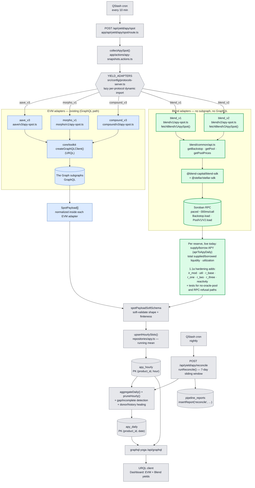
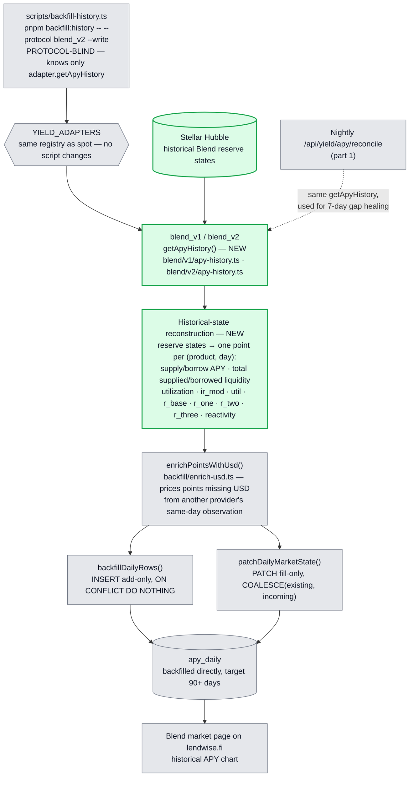
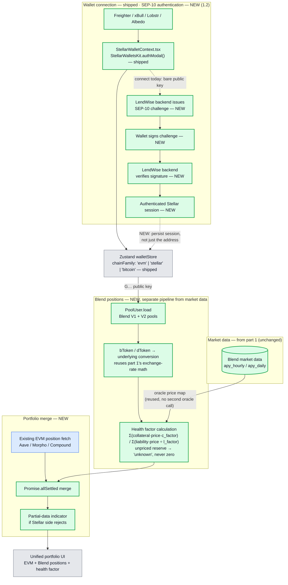
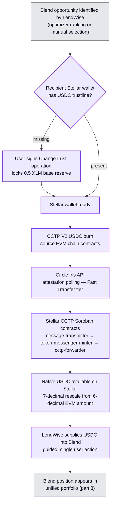
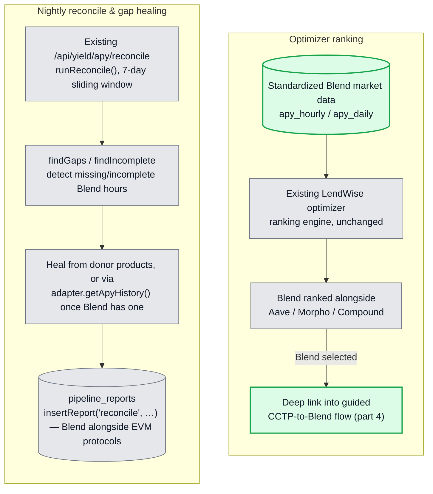
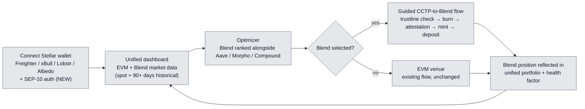

# LendWise — Stellar Cross-Chain Integration Architecture

> **Scope** — the Stellar integration validated in the Stellar Community Fund #45 submission,
> structured around five parts: Blend spot market data, Blend historical data via Stellar Hubble,
> Stellar wallet + SEP-10 auth + Blend positions + health factor + unified portfolio, CCTP
> execution from EVM into Blend, and optimizer ranking + monitoring.
>
> **Legend** — green = NEW bricks added for Stellar ·
> blue = existing EVM pipeline (unchanged) · grey = shared core (unchanged) ·
> purple = cross-chain execution (CCTP).

The integration spans five parts, matching the submission's tranche structure:

1. **Blend spot market data** — live rates and reserve parameters from Blend V1/V2.
2. **Blend historical data** — reserve-state reconstruction from Stellar Hubble.
3. **Wallet, auth & portfolio** — SEP-10, Blend position reads, health factor, unified portfolio.
4. **CCTP execution** — native USDC from an EVM chain into a Blend deposit.
5. **Optimizer & monitoring** — Blend ranked as a venue, nightly gap detection and healing.

---

## 1. Blend spot market data

**Reading the diagram** — matches the code as implemented, not a future design.

- The trigger, registry, `apy_hourly`/`apy_daily`, the nightly reconcile job, and the GraphQL
  serving layer are **shared and unchanged** — protocol-agnostic by design. `YIELD_ADAPTERS` in
  `src/config/protocols-server.ts` is the actual registry: a plain record of lazy dynamic imports
  keyed by protocol id (`aave_v3`, `morpho_v1`, `compound_v3`, `blend_v1`, `blend_v2`).
  `collectApySpot()` calls `getApySpot()` on every registered id via `Promise.allSettled`.
- Existing EVM protocols read through **The Graph subgraphs** via `createGraphQLClient()`.
- **Blend has no subgraph**, so `blend_v1`/`blend_v2` bypass GraphQL entirely, reading **Soroban
  contracts** through the **Blend SDK**. Both share `blend/common/api.ts`, which discovers the
  live pool set from `Backstop.load(...).config.rewardZone` rather than a hardcoded list, and
  serializes every RPC read behind a ~300ms pacing queue to stay under Soroban RPC's rate limit.
  This is the same uniform `<protocol>/<version>/apy-spot.ts` layout every EVM adapter already
  follows (`aave/v3/`, `morpho/v1/`, `compound/v3/`) — not a Blend-specific exception.
- **Already live:** supply/borrow APY, total supplied/borrowed liquidity, and utilization per
  reserve. **Not yet captured — this is 1.1a's hardening deliverable:** the interest rate modifier
  (`ir_mod`) and rate parameters (`util`, `r_base`, `r_one`, `r_two`, `r_three`, `reactivity`),
  plus test coverage for the no-oracle-pool and RPC-refusal failure paths already handled in code.
- Each adapter — EVM or Blend — returns `SpotPayload[]` **already normalized internally**; there is
  no separate shared normalization stage. `collectApySpot()` only soft-validates
  (`spotPayloadSoftSchema`) and upserts via `upsertHourlySlots()`.
- There is no separate daily cron: a single **nightly `/api/yield/apy/reconcile`** job
  (`runReconcile()`, 7-day sliding window) detects gaps/incomplete hours, heals them from donor
  products or via `adapter.getApyHistory()`, aggregates `apy_hourly` into `apy_daily`, prunes old
  hourly rows, and logs one row per run into `pipeline_reports`.

---

## 2. Blend historical data — Stellar Hubble reconstruction

**Reading the diagram**

- Blend has **no subgraph and no history API** of its own, so historical data has to be
  **reconstructed from Stellar Hubble**, not fetched from an existing endpoint.
- **This is not event replay.** The approach reconstructs one point per (product, day) from
  historical **reserve states**, matching the shape every other `getApyHistory` implementation
  already returns.
- This branch is **separate from spot ingestion**: spot reads live Soroban RPC state on a
  10-minute cron and writes `apy_hourly`; historical reconstruction is consumed by two existing,
  protocol-blind callers of `adapter.getApyHistory()` — the manual `scripts/backfill-history.ts`
  harness, which writes straight into `apy_daily` (`backfillDailyRows` for missing days,
  `patchDailyMarketState` to fill market columns on rows that already exist), and the nightly
  reconcile job's gap-healing (part 1) — **neither requires any change**, only registering
  `blend_v1`/`blend_v2`'s `getApyHistory()`.
- Output lands in the same `apy_daily` table every other protocol writes to, which is what lets the
  optimizer (part 5) rank Blend without any Blend-specific handling downstream.

---

## 3. Wallet, SEP-10 auth, Blend positions, health factor & unified portfolio

**Reading the diagram**

- **Auth (top) — connection is shipped, authentication is not.** `StellarWalletContext.tsx`
  already connects **Freighter, xBull, Lobstr, and Albedo** via `StellarWalletsKit.authModal()`
  and writes the address into the existing `walletStore`, which already carries a `chainFamily`
  discriminator (`'evm' | 'stellar' | 'bitcoin'`). What's missing, and what 1.2 adds, is the
  **SEP-10** round trip on top of that connection: the backend issues a challenge transaction, the
  wallet signs it, the backend verifies the signature, and only then is an authenticated
  **session** — not just a bare public key — persisted.
- **Market data vs. positions are two distinct pipelines.** Market data (part 1/2) describes what
  a Blend pool as a whole offers; positions describe what one authenticated wallet holds in it.
  Blend positions are **never** written into `apy_hourly`/`apy_daily` or the nightly cron —
  `PoolUser.load` is a per-user, on-demand read, resolved to a single direct ledger-entry read.
- **Conversion reuses part 1's math.** Blend's bToken/dToken share units convert to underlying
  amounts with the same exchange-rate logic already built for reserve totals in the spot adapter —
  this is a new caller of that logic, not new conversion logic.
- **Health factor reuses the oracle price map** already fetched per-pool in the spot pipeline, so
  computing it costs no second round of oracle calls. An unpriced reserve fails the calculation
  **closed** — shown as "unknown" in the UI — rather than valuing that collateral at zero.
- **Merge is `Promise.allSettled`, not custom logic.** A rejected Stellar-side promise renders the
  EVM side with a partial-data indicator instead of blanking the dashboard — this is
  `allSettled`'s native behavior.

---

## 4. CCTP execution — EVM → Stellar → Blend

**Reading the diagram**

- **Order is load-bearing: trustline check before burn, not after.** Stellar requires an explicit
  trustline before an account can hold any non-native asset, including SEP-41-wrapped USDC — a
  mint to an account without one fails at the ledger level, and that failure only surfaces after
  the source-chain burn has already been attested. The check has to gate the burn, not just the
  mint.
- **The forwarder step is not optional.** Stellar's account model can't receive an arbitrary
  contract's mint the way an EVM address receives an ERC-20 `mint(to, amount)` call, so
  `mintRecipient` is routed to the `cctp-forwarder` contract (with `destinationCaller` also set to
  it) — routing it to the end-user's address directly makes the funds permanently unrecoverable,
  per Circle's own documentation.
- **Fast Transfer is the default finality tier**, since Stellar's own ~5-second finality means the
  attestation wait dominates total transfer time regardless of tier choice.
- **This is not an isolated bridge integration.** The chain is presented as one guided product
  flow — burn → attestation → mint → Blend deposit — triggered from a ranked Blend opportunity
  (part 5), with a transaction hash logged at every step for auditability. This chain is what
  materializes LendWise's cross-chain execution layer for Stellar.

---

## 5. Optimizer & monitoring

**Reading the diagram**

- **Optimizer:** reuses the existing ranking engine as-is — Blend's rates already flow into the
  same `apy_hourly`/`apy_daily` tables every other protocol uses, so surfacing Blend is a UI and
  deep-linking task, not a new ranking engine. Selecting a ranked Blend entry deep-links directly
  into the guided CCTP-to-Blend flow (part 4), tying market intelligence → optimization →
  execution together.
- **Monitoring:** `runReconcile()` behind `/api/yield/apy/reconcile` already runs generically
  across every registered adapter in `YIELD_ADAPTERS`, over a 7-day sliding window
  (`RECONCILE_WINDOW_DAYS`). Registering Blend into that existing gap-detection/healing cycle — no
  new monitoring infrastructure — means every night LendWise checks for holes in the Blend record
  and heals them once `blend_v1`/`blend_v2` implement `getApyHistory()` (part 2), with one row per
  run logged into the same `pipeline_reports` table every other protocol uses.

---

## 6. End-to-end cross-chain user journey

This is the guided flow the submission promises: **connect → compare → optimize → execute**, with
Blend as a first-class venue ranked next to EVM markets and reachable directly from an EVM wallet
via CCTP — with no DEX swap, third-party bridge, or fiat on-ramp step in the path.

---

## 7. New vs existing — at a glance

| Brick                                  | Status         | Library / path                                                          |
| :-------------------------------------- | :------------- | :---------------------------------------------------------------------- |
| Adapter registry                        | existing       | `YIELD_ADAPTERS` — `src/config/protocols-server.ts`                     |
| Spot collection                         | existing       | `collectApySpot()` — `app/actions/apy-snapshots.actions.ts`             |
| EVM lending data                        | existing       | The Graph subgraphs via `createGraphQLClient()` (URQL)                  |
| `apy_hourly` / `apy_daily`              | existing       | `repositories/apy.ts` + Drizzle schema                                  |
| Nightly reconcile (aggregate/heal)      | existing       | `/api/yield/apy/reconcile` — `runReconcile()`, 7-day sliding window     |
| GraphQL serving                         | existing       | `graphql-yoga` `/api/graphql`                                           |
| Existing EVM position fetch             | existing       | portfolio data-fetch layer                                              |
| Existing optimizer ranking engine       | existing       | optimizer module, unchanged                                             |
| Blend V1 spot adapter                   | **shipped**    | `src/lib/protocols/blend/v1/apy-spot.ts`                                |
| Blend V2 spot adapter                   | **shipped**    | `src/lib/protocols/blend/v2/apy-spot.ts`                                |
| Blend data source                       | **shipped**    | `@blend-capital/blend-sdk` + `@stellar/stellar-sdk` over Soroban RPC    |
| Stellar wallet connection               | **shipped**    | `StellarWalletContext.tsx` — Freighter / xBull / Lobstr / Albedo        |
| `chainFamily` store field               | **shipped**    | `src/stores/walletStore.ts`                                             |
| **Blend rate-parameter fields**         | **NEW (1.1a)** | `ir_mod` / `util` / `r_base` / `r_one` / `r_two` / `r_three` / `reactivity` + failure-path tests |
| **Blend historical adapter**            | **NEW (1.1b)** | `blend/v1/apy-history.ts` + `blend/v2/apy-history.ts` — `getApyHistory()` |
| **Stellar Hubble backfill**             | **NEW (1.1b)** | historical reserve-state reconstruction, consumed by existing `scripts/backfill-history.ts` and reconcile |
| **SEP-10 authentication**               | **NEW (1.2)**  | backend challenge endpoint + client-side signing flow + session persistence |
| **Blend position reads**                | **NEW (2.1a)** | `PoolUser.load` + bToken/dToken conversion                              |
| **Health factor calculation**           | **NEW (2.1b)** | per-reserve collateral/liability factors, reused oracle price map       |
| **Portfolio merge**                     | **NEW (2.2b)** | `Promise.allSettled` + partial-data indicator                          |
| **CCTP trustline check & ChangeTrust**  | **NEW (3.1b)** | `src/lib/execution/cctp/trustline.ts`                                  |
| **CCTP burn (EVM) + forwarder mint**    | **NEW (3.1a)** | `src/lib/execution/cctp/` — Circle CCTP V2 + Stellar Soroban contracts  |
| **CCTP attestation → Blend deposit**    | **NEW (3.1c)** | Circle Iris polling client + chained Blend Supply call                 |
| **Optimizer ranking surfacing**         | **NEW (3.2a)** | Blend added as ranked venue + deep link into CCTP flow                 |
| **Monitoring / gap-heal extension**     | **NEW (3.2b)** | Blend registered into existing reconcile + `pipeline_reports`          |
