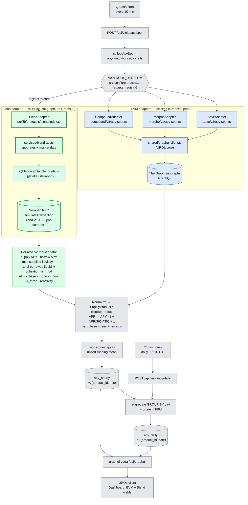
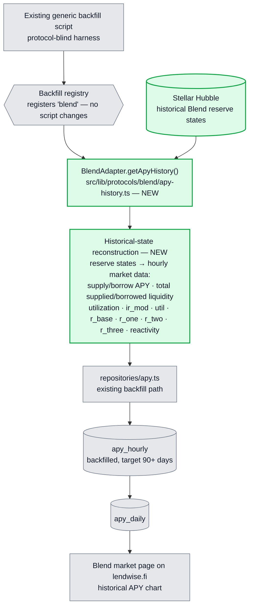
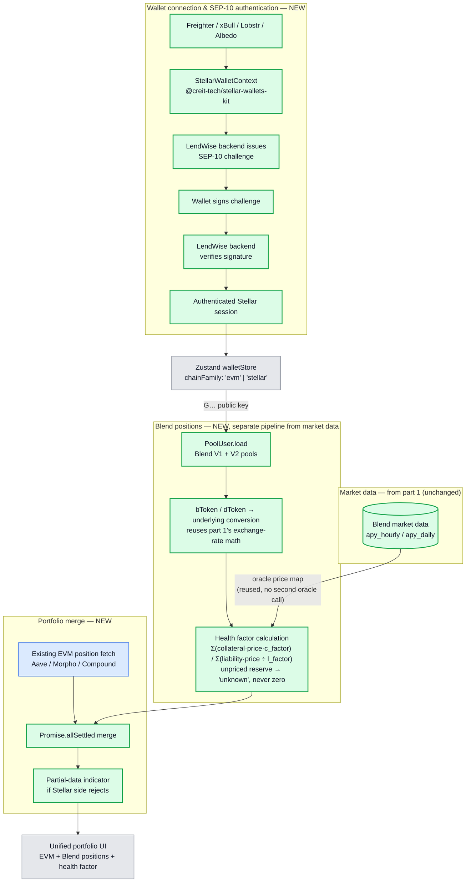
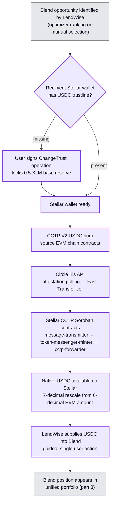
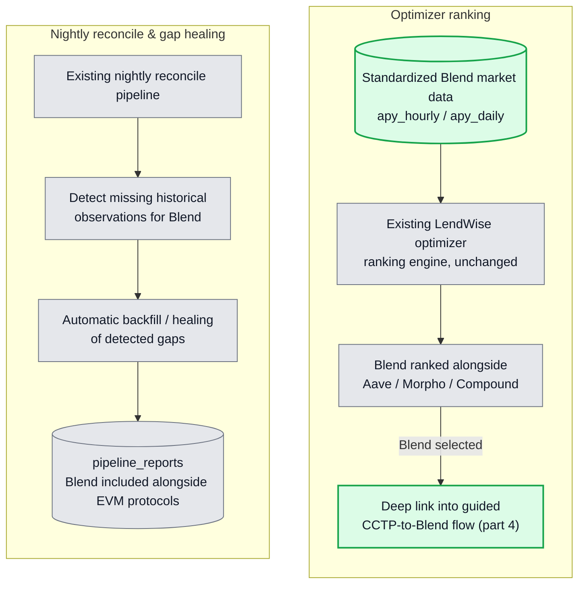
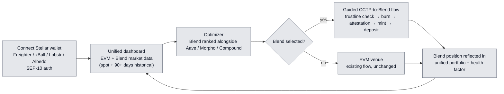

# LendWise — Stellar Cross-Chain Integration Architecture

> **Scope** — the Stellar integration validated in the Stellar Community Fund #45 submission,
> structured around five parts: Blend spot market data, Blend historical data via Stellar Hubble,
> Stellar wallet + SEP-10 auth + Blend positions + health factor + unified portfolio, CCTP
> execution from EVM into Blend, and optimizer ranking + monitoring. There is no DEX-liquidity
> integration (Aquarius/StellarX), no third-party bridge integration (Allbridge/Squid), and no
> fiat on-ramp (MoneyGram/SEP-0024) in this scope.
>
> **Legend** — green = NEW bricks added for Stellar ·
> blue = existing EVM pipeline (unchanged) · grey = shared core (unchanged) ·
> purple = cross-chain execution (CCTP).

The integration spans five parts, matching the submission's tranche structure:

1. **Blend spot market data** — live rates and reserve parameters from Blend V1/V2.
2. **Blend historical data** — reserve-state reconstruction from Stellar Hubble.
3. **Wallet, auth & portfolio** — SEP-10, Blend position reads, health factor, unified portfolio.
4. **CCTP execution** — native USDC from an EVM chain into a Blend deposit.
5. **Optimizer & monitoring** — Blend ranked as a venue, nightly gap detection and healing.

---

## 1. Blend spot market data

**Reading the diagram**

- The trigger, registry, normalization, `apy_hourly`/`apy_daily`, and the GraphQL serving layer
  are **shared and unchanged** — they are protocol-agnostic by design.
- **Blend has no subgraph**, so the adapter bypasses GraphQL entirely: it discovers the live pool
  set from `Backstop.load(...).config.rewardZone`, then reads supply APY, borrow APY, total
  supplied liquidity, total borrowed liquidity, utilization, the interest rate modifier (`ir_mod`),
  and the interest rate parameters (`util`, `r_base`, `r_one`, `r_two`, `r_three`, `reactivity`)
  for each reserve across **Blend V1 and V2**, then hands normalized `SupplyProduct`/
  `BorrowProduct` objects to the same pipeline as every other protocol.
- Adding Blend = register `'blend'` in `PROTOCOL_REGISTRY` + ship the green bricks. Nothing in the
  blue/grey path changes.

---

## 2. Blend historical data — Stellar Hubble reconstruction

**Reading the diagram**

- Blend has **no subgraph and no history API** of its own, so historical data has to be
  **reconstructed from Stellar Hubble**, not fetched from an existing endpoint.
- **This is not event replay.** The approach reconstructs hourly market data from historical
  **reserve states**, matching the shape produced by the spot adapter in part 1.
- This branch is **separate from spot ingestion**: spot reads live Soroban RPC state on a
  10-minute cron; historical reconstruction reads Hubble through the existing protocol-blind
  backfill harness, requiring no changes to the harness itself.
- Output lands in the same `apy_hourly`/`apy_daily` tables every other protocol writes to, which is
  what lets the optimizer (part 5) rank Blend without any Blend-specific handling downstream.

---

## 3. Wallet, SEP-10 auth, Blend positions, health factor & unified portfolio

**Reading the diagram**

- **Auth (top):** connecting a Stellar wallet is a full **SEP-10** round trip, not a bare key
  read — the backend issues a challenge transaction, the wallet (**Freighter, xBull, Lobstr, or
  Albedo**) signs it, the backend verifies the signature, and only then is a session persisted
  into the existing `walletStore` once it carries a `chainFamily` discriminator.
- **Market data vs. positions are two distinct pipelines.** Market data (part 1/2) describes what
  a Blend pool as a whole offers; positions describe what one authenticated wallet holds in it.
  Blend positions are **never** written into `apy_hourly`/`apy_daily` or the nightly cron —
  `PoolUser.load` is a per-user, on-demand read, resolved to a single direct ledger-entry read.
- **Conversion reuses part 1's math.** Blend's bToken/dToken share units convert to underlying
  amounts with the same exchange-rate logic already built for reserve totals in the spot adapter —
  this is a new caller of that logic, not new conversion logic.
- **Health factor reuses the oracle price map** already fetched per-pool in the spot pipeline, so
  computing it costs no second round of oracle calls. An unpriced reserve fails the calculation
  **closed** — shown as "unknown" in the UI — rather than valuing that collateral at zero.
- **Merge is `Promise.allSettled`, not custom logic.** A rejected Stellar-side promise renders the
  EVM side with a partial-data indicator instead of blanking the dashboard — this is
  `allSettled`'s native behavior.

---

## 4. CCTP execution — EVM → Stellar → Blend

**Reading the diagram**

- **Order is load-bearing: trustline check before burn, not after.** Stellar requires an explicit
  trustline before an account can hold any non-native asset, including SEP-41-wrapped USDC — a
  mint to an account without one fails at the ledger level, and that failure only surfaces after
  the source-chain burn has already been attested. The check has to gate the burn, not just the
  mint.
- **The forwarder step is not optional.** Stellar's account model can't receive an arbitrary
  contract's mint the way an EVM address receives an ERC-20 `mint(to, amount)` call, so
  `mintRecipient` is routed to the `cctp-forwarder` contract (with `destinationCaller` also set to
  it) — routing it to the end-user's address directly makes the funds permanently unrecoverable,
  per Circle's own documentation.
- **Fast Transfer is the default finality tier**, since Stellar's own ~5-second finality means the
  attestation wait dominates total transfer time regardless of tier choice.
- **This is not an isolated bridge integration.** The chain is presented as one guided product
  flow — burn → attestation → mint → Blend deposit — triggered from a ranked Blend opportunity
  (part 5), with a transaction hash logged at every step for auditability. This chain is what
  materializes LendWise's cross-chain execution layer for Stellar.

---

## 5. Optimizer & monitoring

**Reading the diagram**

- **Optimizer:** reuses the existing ranking engine as-is — Blend's rates already flow into the
  same `apy_hourly`/`apy_daily` tables every other protocol uses, so surfacing Blend is a UI and
  deep-linking task, not a new ranking engine. Selecting a ranked Blend entry deep-links directly
  into the guided CCTP-to-Blend flow (part 4), tying market intelligence → optimization →
  execution together.
- **Monitoring:** the nightly reconcile job already runs generically across every registered
  adapter. Registering Blend into that existing gap-detection/healing cycle — no new monitoring
  infrastructure — means every night LendWise checks for holes in the Blend historical record and
  automatically backfills them when found, visible in the same `pipeline_reports` log as every
  other protocol.

---

## 6. End-to-end cross-chain user journey

This is the guided flow the submission promises: **connect → compare → optimize → execute**, with
Blend as a first-class venue ranked next to EVM markets and reachable directly from an EVM wallet
via CCTP — with no DEX swap, third-party bridge, or fiat on-ramp step in the path.

---

## 7. New vs existing — at a glance

| Brick                                 | Status   | Library / path                                                          |
| :------------------------------------- | :------- | :---------------------------------------------------------------------- |
| Adapter registry                       | existing | `PROTOCOL_REGISTRY` — `src/config/protocols.ts`                         |
| Spot collection                        | existing | `collectApySpot()` — `apy-snapshots.actions.ts`                         |
| EVM lending data                       | existing | The Graph subgraphs via `shared/graphql-client.ts` (URQL)               |
| `apy_hourly` / `apy_daily`             | existing | `repositories/apy.ts` + Drizzle schema                                  |
| GraphQL serving                        | existing | `graphql-yoga` `/api/graphql`                                           |
| Existing EVM position fetch            | existing | portfolio data-fetch layer                                              |
| Existing optimizer ranking engine      | existing | optimizer module, unchanged                                             |
| Existing nightly reconcile pipeline    | existing | protocol-blind reconcile job                                            |
| **Blend spot adapter**                 | **NEW**  | `src/lib/protocols/blend/index.ts`                                      |
| **Blend data source**                  | **NEW**  | `@blend-capital/blend-sdk-js` + `@stellar/stellar-sdk` over Soroban RPC |
| **Blend historical adapter**           | **NEW**  | `src/lib/protocols/blend/apy-history.ts` — `getApyHistory()`            |
| **Stellar Hubble backfill**            | **NEW**  | historical reserve-state reconstruction, registered in existing harness |
| **Stellar wallet**                     | **NEW**  | `@creit-tech/stellar-wallets-kit` + `StellarWalletContext` — Freighter / xBull / Lobstr / Albedo |
| **SEP-10 authentication**              | **NEW**  | backend challenge endpoint + client-side signing flow                  |
| **`chainFamily` store field**          | **NEW**  | `src/stores/walletStore.ts`                                             |
| **Blend position reads**               | **NEW**  | `PoolUser.load` + bToken/dToken conversion                              |
| **Health factor calculation**          | **NEW**  | per-reserve collateral/liability factors, reused oracle price map       |
| **Portfolio merge**                    | **NEW**  | `Promise.allSettled` + partial-data indicator                          |
| **CCTP trustline check & ChangeTrust**  | **NEW**  | `src/lib/execution/cctp/trustline.ts`                                  |
| **CCTP burn (EVM) + forwarder mint**    | **NEW**  | `src/lib/execution/cctp/` — Circle CCTP V2 + Stellar Soroban contracts  |
| **CCTP attestation → Blend deposit**    | **NEW**  | Circle Iris polling client + chained Blend Supply call                 |
| **Optimizer ranking surfacing**        | **NEW**  | Blend added as ranked venue + deep link into CCTP flow                 |
| **Monitoring / gap-heal extension**    | **NEW**  | Blend registered into existing reconcile + `pipeline_reports`          |
